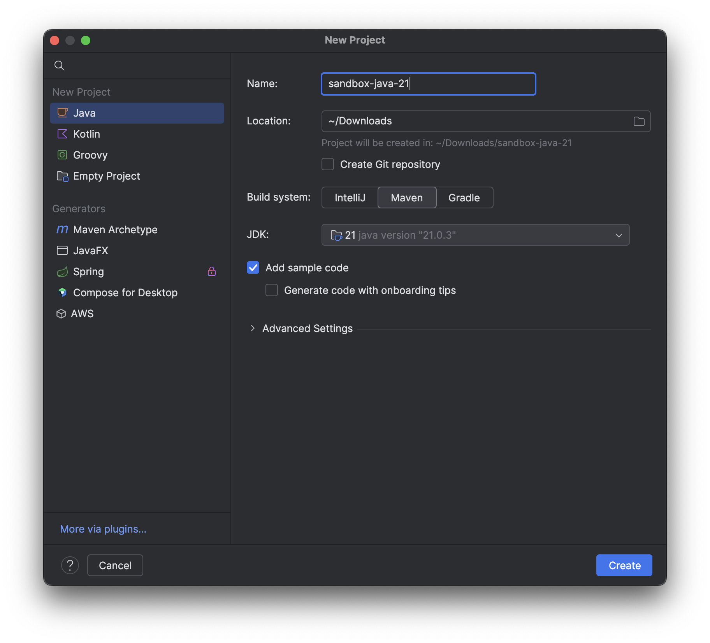

# Java Intro

## History of Java 
- Java is programing language that created by James Gosling at 1991
- Initially named Oak but later change to Java from type of coffee ☕️ from Java, Indonesia 🇮🇩
- Sun Microsystems (if you know this company name means you old already 😂) release Java 1.0 in 1996
- The idea of java is "Write once, run anywhere" which is until today we can see it can run on any major cloud provider computing. 

## Install Java

I will show how to install Java on Mac, while for windows is mostly the same.

### Download the binary
Java have many distro which you can choose according to your needs, but since majority of my work is run on AWS i prefer to using amazon corretto. 

Ensure you choose LTS (Long Term Support) as this version will have longer updates. For completed list of operating system can click this [links](https://docs.aws.amazon.com/corretto/latest/corretto-21-ug/downloads-list.html).

```
curl -LO https://corretto.aws/downloads/latest/amazon-corretto-21-aarch64-macos-jdk.pkg
```


### Install the binary
  

 1. Double click the installation package and just follow the step of instruction. Once the process completes, Amazon Corretto 21 is installed in `/Library/Java/JavaVirtualMachines/`
 
 
 
 2. Setting the path `export JAVA_HOME=/Library/Java/JavaVirtualMachines/amazon-corretto-21.jdk/Contents/Home` on your `.profile` or `.bash_profile` or `.zprofile.` Once update then restart the terminal session.

 3. Check if installation all good by execute this command `java -version`. You should see something like this

 ```
% java -version
openjdk version "21.0.3" 2024-04-16 LTS
OpenJDK Runtime Environment Corretto-21.0.3.9.1 (build 21.0.3+9-LTS)
OpenJDK 64-Bit Server VM Corretto-21.0.3.9.1 (build 21.0.3+9-LTS, mixed mode, sharing)
 ```
 Congratulations you just install Java on your machine.
 

## Our First Program
As of today there is a lot of IDE that you can use for create a java program, one of popular IDE is Intellij. So lets using this IDE for our first program, you can download from this
[links](https://www.jetbrains.com/idea/download/?section=mac). You can choose for community edition which have good enough feature to start our code.

1. Once installation is done, lets do `File > New > Project`
2. It will open a pop-up window, just fill in:
    - project name to `sandbox-java-21`  
    - location you can choose your own
    - build system choose `maven` 
    - jdk ensure using 21

    

3. Click `create` and it will open new window
4. As you notice on left side there is `Main`, double click on it and it will open new tab window which have the pre-generated code.
5. Try to run in by clicking play button
6. As you can see now we successfully run our first java program.

